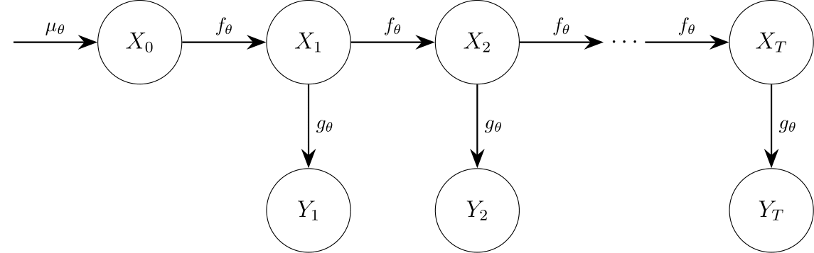

<!-- README.md is generated from README.Rmd. Please edit that file -->

```{r, include = FALSE}
knitr::opts_chunk$set(
  collapse = TRUE,
  comment = "#>",
  fig.path = "man/figures/README-",
  out.width = "100%"
)
```

# bayesSSM 

<!-- badges: start -->
[](https://app.codecov.io/gh/BjarkeHautop/bayesSSM)
[](https://github.com/BjarkeHautop/bayesSSM/actions/workflows/R-CMD-check.yaml)
<!-- badges: end -->

bayesSSM is an R package offering a set of tools for performing Bayesian 
inference in state-space models (SSMs). It implements the
Particle Marginal Metropolis-Hastings (PMMH) for Bayesian inference. 

> **Note:** This package is under active development and may undergo 
significant changes. It is not yet recommended for production use.

## Installation

You can install the development version of bayesSSM from 
[GitHub](https://github.com/) with:

``` r
# install.packages("pak")
pak::pak("BjarkeHautop/bayesSSM")
```

## Example

Consider the following SSM:

$$
\begin{aligned}
		X_1 &\sim N(0,1) \\
		X_t&=\phi X_{t-1}+\sin(X_{t-1})+\sigma_x V_t, \quad V_t \sim N(0,1) \\
		Y_t&=X_t+\sigma_y W_t, \quad W_t \sim N(0, \, 1).
\end{aligned}
$$

Let's first simulate some data from this model with $\phi = 0.8$, $\sigma_x = 1$,
and $\sigma_y = 0.5$.

```{r}
t_val <- 20
phi_val <- 0.8
sigma_x_val <- 1
sigma_y_val <- 0.5

x <- numeric(t_val)
y <- numeric(t_val)
x[1] <- rnorm(1, mean = 0, sd = sigma_x_val)
y[1] <- rnorm(1, mean = x[1], sd = sigma_y_val)
for (t in 2:t_val) {
  x[t] <- phi_val * x[t - 1] + sin(x[t - 1]) + rnorm(1, mean = 0, 
                                                     sd = sigma_x_val)
  y[t] <- x[t] + rnorm(1, mean = 0, sd = sigma_y_val)
}
```

We define the priors for our model as follows:

$$
\begin{aligned}
		\phi &\sim N(0,1), \\
		\sigma_x &\sim \text{Exp}(1), \\
		\sigma_y &\sim \text{Exp}(1).
\end{aligned}
$$

We can use `pmmh` to perform Bayesian inference on this model. To use `pmmh`
we need to define the functions for the SSM and the priors. The functions 
`init_fn_ssm`, `transition_fn_ssm` should be functions that simulates the
latent state variables and the observed data. They must contain the argument
`particles` which is a vector of particles, and can contain any other args as
parameters. The function `log_likelihood_fn_ssm` should be a function that
calculates the log-likelihood of the observed data given the latent state
variables. It must contain the arguments `y` and `particles`.

The priors for the parameters must be defined as log-prior functions. Every 
parameter must have a corresponding log-prior function.

```{r}
init_fn_ssm <- function(particles) {
  stats::rnorm(particles, mean = 0, sd = 1)
}
transition_fn_ssm <- function(particles, phi, sigma_x) {
  phi * particles + sin(particles) +
    stats::rnorm(length(particles), mean = 0, sd = sigma_x)
}
log_likelihood_fn_ssm <- function(y, particles, sigma_y) {
  stats::dnorm(y, mean = particles, sd = sigma_y, log = TRUE)
}
log_prior_phi <- function(phi) {
  stats::dnorm(phi, mean = 0, sd = 1, log = TRUE)
}
log_prior_sigma_x <- function(sigma) {
  stats::dexp(sigma, rate = 1, log = TRUE)
}
log_prior_sigma_y <- function(sigma) {
  stats::dexp(sigma, rate = 1, log = TRUE)
}

log_priors <- list(
  phi = log_prior_phi,
  sigma_x = log_prior_sigma_x,
  sigma_y = log_prior_sigma_y
)
```

Note, that `init_fn_ssm` must take an argument `particles` and return a vector
of initial values for the latent state variables. `transition_fn_ssm` must take
arguments `particles`, and `log_likelihood_fn_ssm` must take arguments `y` and
`particles`. Any parameters for the SSM can be given as additional arguments to
the functions. Any parameter must have a corresponding log-prior function in
`log_priors`.

Now we can run the PMMH algorithm using the `pmmh` function. We run 2 chains for
200 MCMC samples with a burn-in of 10. 
In practice you would want to run it for a much larger number of samples. 

```{r example}
library(bayesSSM)

result <- pmmh(
  y = y,
  m = 200, # number of MCMC samples
  init_fn_ssm = init_fn_ssm,
  transition_fn_ssm = transition_fn_ssm,
  log_likelihood_fn_ssm = log_likelihood_fn_ssm,
  log_priors = log_priors,
  init_params = c(phi = 0.5, sigma_x = 0.5, sigma_y = 0.5),
  burn_in = 10,
  num_chains = 2,
  seed = 1405
)
```

We get convergence warnings because we only ran the algorithm for a small number
of samples. 

## State-space Models

State-space models are used to describe systems that evolve over time with 
latent (hidden) state variables. The typical SSM is structured as a 
directed acyclic graph (DAG):



Key components include:

- Latent state variables $X_t$ that evolve over time according to a 
  transition distribution $f_\theta(X_t | X_{t-1})$.
  
- Observed data $Y_t$ that are generated from the latent state variables
  according to an observation distribution $g_\theta(Y_t | X_t)$.
  
- Parameters $\theta$ that govern the transition and observation 
  distributions.
  
- Initial distribution $\mu(X_1)$ that describes the distribution of the 
  latent state variables at time $t = 1$. Defined by `init_fn_ssm` in `pmmh`.
  
- Log-likelihood $\log p(Y_t | \theta)$ that describes the likelihood of 
  the observed data given the latent state variables. Defined by 
  `log_likelihood_fn_ssm` in `pmmh`.
  
- Log-prior $\log p(\theta)$ that describes the prior distribution of the 
  parameters. Defined by `log_priors` in `pmmh`.

## Particle Marginal Metropolis-Hastings

The core function, `pmmh`, implements the Particle Marginal Metropolis-Hastings, 
which is an algorithm that first generates a set of $N$ particles to approximate
the likelihood and then uses these particles to perform MCMC sampling of the
parameters $\theta$. The implementation automatically tunes the number of
particles and the proposal distribution for the parameters, which can be 
modified by `default_tune_control`.


